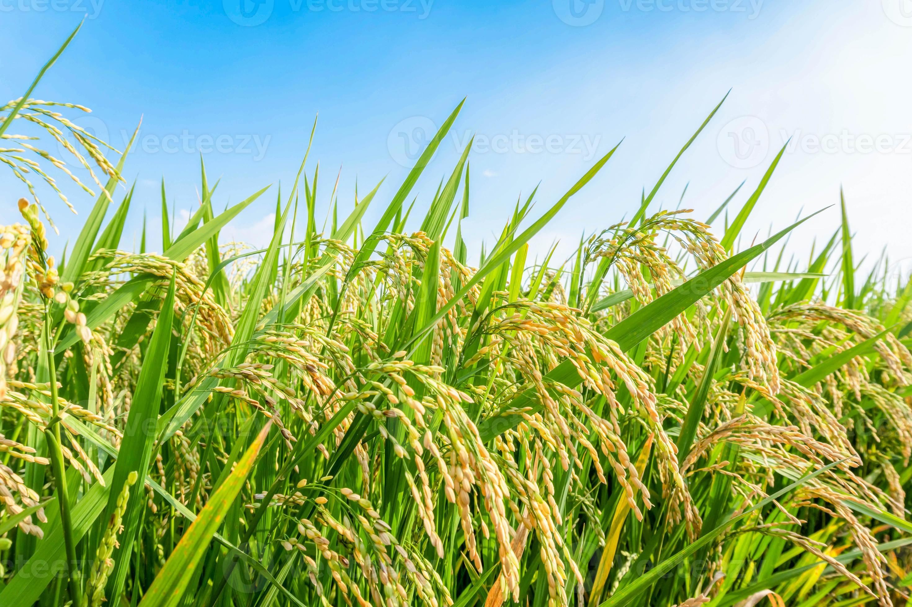
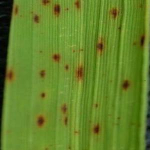
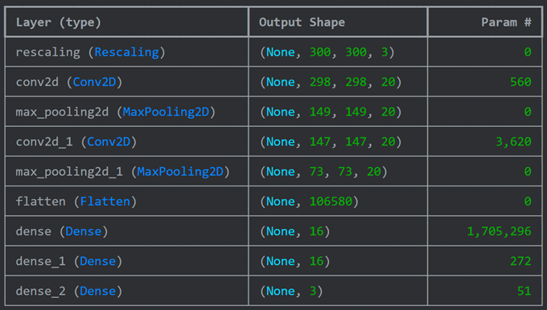
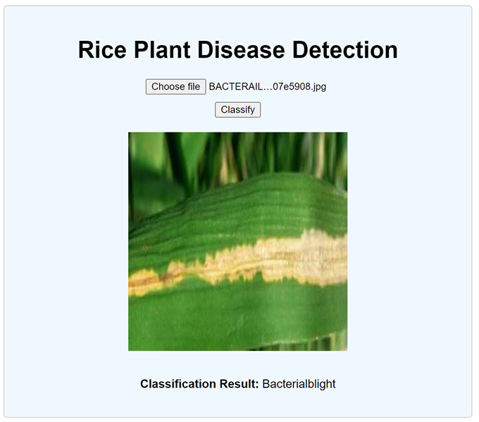
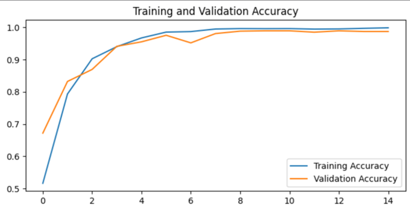

# Rice Plant Disease Detection System

An automated system for detecting rice plant diseases using image processing and machine learning to improve agricultural productivity.

# Installation Guide

## Overview
This guide provides step-by-step instructions to set up and install the Automated Rice Plant Disease Detection project. This project uses image processing and machine learning techniques to detect diseases in rice plants, with an integrated web application for real-time diagnosis.

## Table of Contents
- [Prerequisites](#prerequisites)
- [Clone the Repository](#clone-the-repository)
- [Environment Setup](#environment-setup)
- [Install Dependencies](#install-dependencies)
- [Run Web-App](#run-web-app)
- [Documentation](#documentation)

### Prerequisites
- Python 3.7 or higher
- pip (Python package installer)
- Git

### Clone the Repository
First, clone the repository to your local machine:
```sh
git clone https://github.com/yourusername/rice-plant-disease-detection.git
```
Navigate to the project directory:
```sh
cd rice-plant-disease-detection
```

### Environment Setup
It is recommended to create a virtual environment to manage dependencies:
```sh
python -m venv venv
source venv/bin/activate  # On Windows, use `venv\Scripts\activate`
```

### Install Dependencies
Install the required Python packages:
```sh
pip install -r requirements.txt
```

### Run Web App
Launch the Web App:
```sh
python frontend/main.py
```
By following this guide, you will have set up the Automated Rice Plant Disease Detection project, including the machine learning model and the Web application for real-time use. For further details on using the application and interpreting results, refer to the further README file.

---

## Documentation

- [Introduction](#introduction)
- [Literary Survey](#literary-survey)
- [Methodology](#methodology)
- [Results and Discussion](#results-and-discussion)
- [Conclusion](#conclusion)

---

## Introduction

### RICE PLANT DISEASE DETECTION

Agriculture is a primary source of income in many countries worldwide. Given its importance, farmers meticulously select crops and implement appropriate measures, including pesticide use, to enhance plant growth within limited timeframes. Rice, a staple food crop in numerous nations, faces significant challenges due to diseases that adversely impact both the quality and quantity of yields. Factors such as a shortage of agricultural experts, inadequate knowledge in fertilizer management, and limited awareness of diseases and pests contribute to reduced production rates.



Plant diseases not only directly harm crop yield but also indirectly contribute to environmental damage. Globally spreading diseases disrupt plant functioning and substantially diminish crop numbers, thereby affecting financial stability. Rice plants are susceptible to various bacterial and fungal diseases, including Sheath Blight, NBSD Leaf Blast, and Brown Spot, each varying in severity.

**Brown Spot** is caused by the Bipolaris oryzae fungus and is prevalent throughout the growing season, especially in silicon-deficient soils, leading to significant crop damage. In Asia alone, 10 to 15% of rice production is lost due to diseases. Traditional disease analysis and monitoring methods, relying on manual inspection by farming experts, are time-consuming and labor-intensive. Timely disease detection is crucial, as delays can result in crop failures.



To address this, automated systems utilizing image processing and machine learning (ML) algorithms have been developed to diagnose rice plant diseases. The accuracy of disease identification hinges on three key processes: feature segmentation, feature extraction, and classification algorithms. Deep learning techniques have shown promising results in image classification tasks, including disease identification.

Researchers have expanded the scope of disease identification beyond rice to include other crops such as mangoes, apples, tomatoes, and wheat. Utilizing images captured in paddy fields, they preprocess the data, segment infected parts of leaves, extract relevant features, and employ ML techniques for disease classification. This automated approach aids farmers in promptly detecting diseases, thus mitigating crop losses and improving agricultural productivity.

---

## Literary Survey

Machine learning-based plant disease detection, particularly focusing on rice plants, reveals a growing body of research aimed at addressing agricultural challenges and enhancing crop management practices. Here's a summary of key findings and trends from recent studies:

1. **Dataset Diversity**: Researchers emphasize the importance of diverse datasets comprising images of both healthy and diseased plants. Studies highlight the significance of large-scale datasets to train machine learning models effectively. Efforts are made to ensure the inclusion of various disease types and severity levels to enhance model generalization.

2. **Model Architectures**: Convolutional Neural Networks (CNNs) emerge as the predominant choice for disease detection tasks due to their ability to learn intricate patterns from image data. Researchers explore different CNN architectures, including variants like ResNet, VGG, and DenseNet, to improve accuracy and efficiency.



3. **Feature Extraction and Representation**: Feature extraction plays a crucial role in capturing discriminative characteristics from input images. Studies investigate various feature extraction techniques, such as transfer learning and feature fusion, to enhance model performance. Additionally, attention mechanisms are explored to focus on relevant regions within images, improving disease detection accuracy.

4. **Challenges and Solutions**: Challenges in disease detection include variations in environmental conditions, disease progression stages, and image quality. Researchers propose solutions like data augmentation, domain adaptation, and ensemble learning to address these challenges and improve model robustness.

5. **Real-Time Detection**: With the increasing demand for real-time monitoring in agriculture, researchers explore methods for deploying trained models on edge devices. Techniques such as model quantization, lightweight architectures, and hardware acceleration enable efficient inference on resource-constrained platforms, facilitating on-site disease detection.

6. **Integration with Agricultural Systems**: Studies emphasize the integration of disease detection systems with existing agricultural technologies to provide farmers with user-friendly tools for decision-making. Mobile applications, web-based interfaces, and IoT platforms are explored for seamless deployment and adoption in agricultural settings.



7. **Future Directions**: Future research directions include the development of multi-modal approaches combining image and sensor data for comprehensive plant health assessment. Additionally, efforts are directed towards addressing challenges in disease localization and quantification, advancing towards precise and automated disease management solutions.

Machine learning-based plant disease detection underscores the potential of AI technologies in revolutionizing agriculture by enabling early disease detection, optimizing resource utilization, and enhancing crop yield and quality. Ongoing research efforts focus on addressing existing challenges and advancing towards scalable, practical solutions for sustainable crop production.

---

## Methodology

### 1. Dataset
I downloaded the data from [Kaggle](https://www.kaggle.com/datasets/jay7080dev/rice-plant-diseases-dataset).

### 2. Approach
Machine learning-based rice plant disease detection involves training algorithms to analyze images of rice plants and accurately classify them as healthy or diseased based on visual symptoms. These algorithms are trained on large datasets of images that include examples of healthy rice plants as well as those affected by different diseases.

The process generally involves the following steps:

#### i. Data Collection
Gather a diverse dataset of images of rice plants, encompassing both healthy plants and those afflicted by various diseases.

#### ii. Data Preprocessing
Preprocess the images to standardize them for input into the machine learning model. This may entail resizing, normalization, and augmentation techniques to enhance dataset diversity.

#### iii. Model Training
Employ a machine learning model, typically a convolutional neural network (CNN), to train on the preprocessed dataset. During training, the model discerns patterns and features in the images distinguishing healthy plants from diseased ones.

#### iv. Validation
Assess the trained model's performance on a separate validation dataset to evaluate its efficacy. Fine-tune hyperparameters if necessary to enhance performance.

#### v. Testing
Evaluate the trained model's performance on an independent test dataset to provide an unbiased estimate of its accuracy and effectiveness in real-world scenarios.

#### vi. Deployment
Upon satisfactory performance, deploy the model for practical use. This could involve integrating it into mobile or web applications accessible to farmers or agricultural experts for swift assessment of rice plant health in the field.

---

## Results and Discussion

The model exhibits proficiency in predicting diseases like 'Bacterial leaf blight,' 'Brown spot,' and 'Leaf smut' in plants, achieving an overall performance accuracy of 99.98%. This indicates its effectiveness in detecting rice plant diseases.



Challenges persist, particularly in accurately identifying diseases with subtle symptoms or variations. Further refinement of the model is warranted to address these nuances.

Future directions may involve expanding the dataset to encompass a broader range of rice plant diseases, thereby enhancing the model's ability to recognize diverse manifestations. Additionally, refining the model architecture could lead to improved performance.

Integration of real-time disease detection capabilities into agricultural technology platforms presents a promising avenue for enhancing practical utility for farmers. This would empower them with timely insights, enabling proactive disease management strategies.

---

## Conclusion

I've developed a convolutional neural network (CNN) system tailored for detecting diseases in rice plants, leveraging a diverse dataset encompassing images of both healthy and diseased specimens. The model has shown promising outcomes, accurately identifying the presence of diseases.

My findings underscore the considerable potential of machine learning algorithms, particularly CNNs, in automating plant disease detection processes. This advancement facilitates early intervention and mitigation measures, thereby fortifying crop health and bolstering agricultural productivity.

While the model has achieved satisfactory accuracy and performance metrics, challenges persist in accurately discerning diseases with subtle symptoms or variations.

Future research endeavors should prioritize addressing these challenges by expanding the dataset, refining the model architecture, and integrating real-time disease detection capabilities into agricultural technology platforms.

Ultimately, the development of robust and dependable plant disease detection systems holds transformative potential for revolutionizing crop management practices. These systems empower farmers with timely insights for decision-making, thereby contributing significantly to global food security initiatives.

---

Feel free to contribute to this project by cloning the repository and making improvements or reporting issues. Together, we can help farmers around the world improve their yields and ensure food security.
